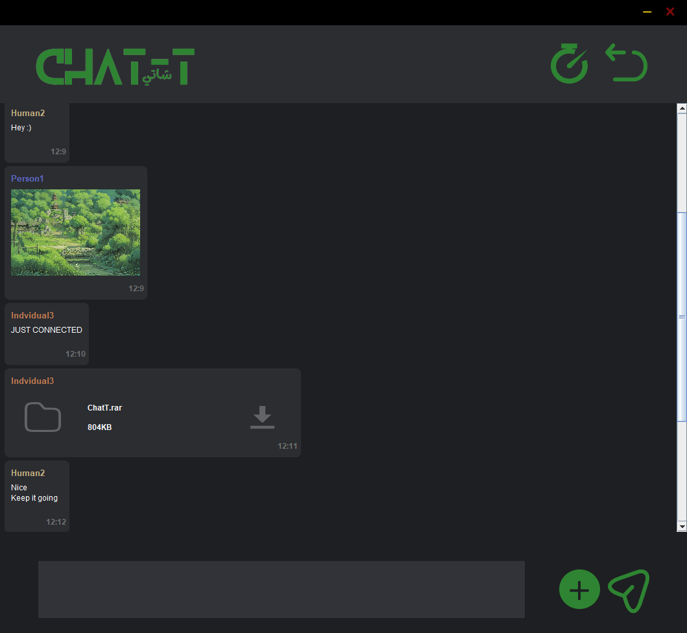
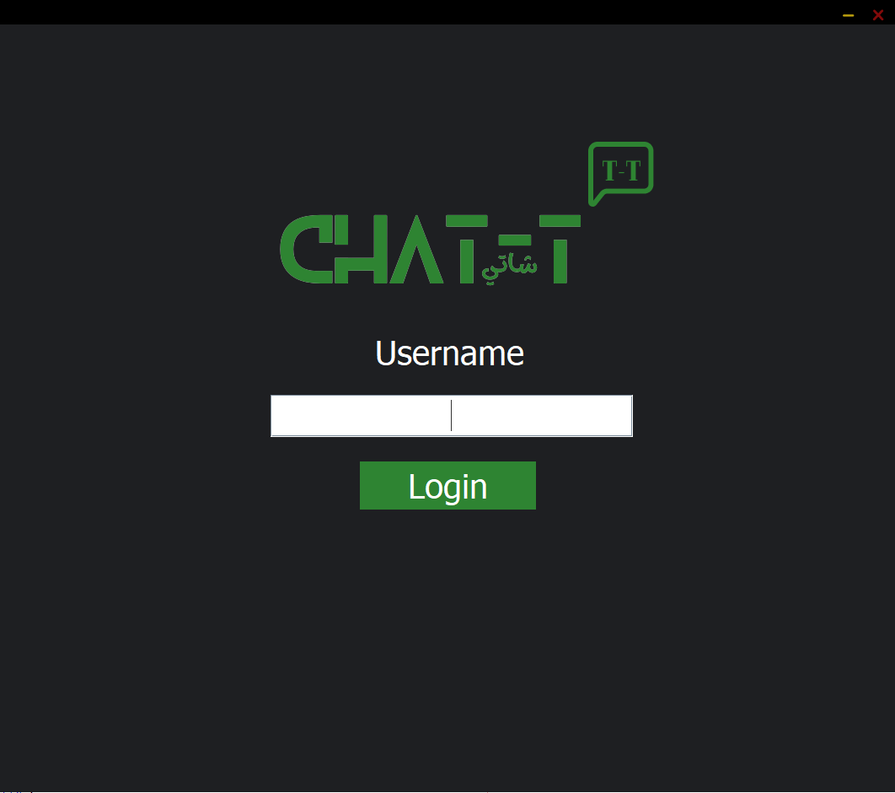

## Projects For CS Courses
This repo contains small size projects made for CS courses

### ChatT(Socket Chat Room Application)
This project uses sockets to send text, images, file messages between multiple clients handled by the server, it also uses RMI(Remote Method Invocation) to access and save the messages into the database, The CLIENT has the ability to download and upload files and images with eachother, both the Client and Server are written in pure Java

