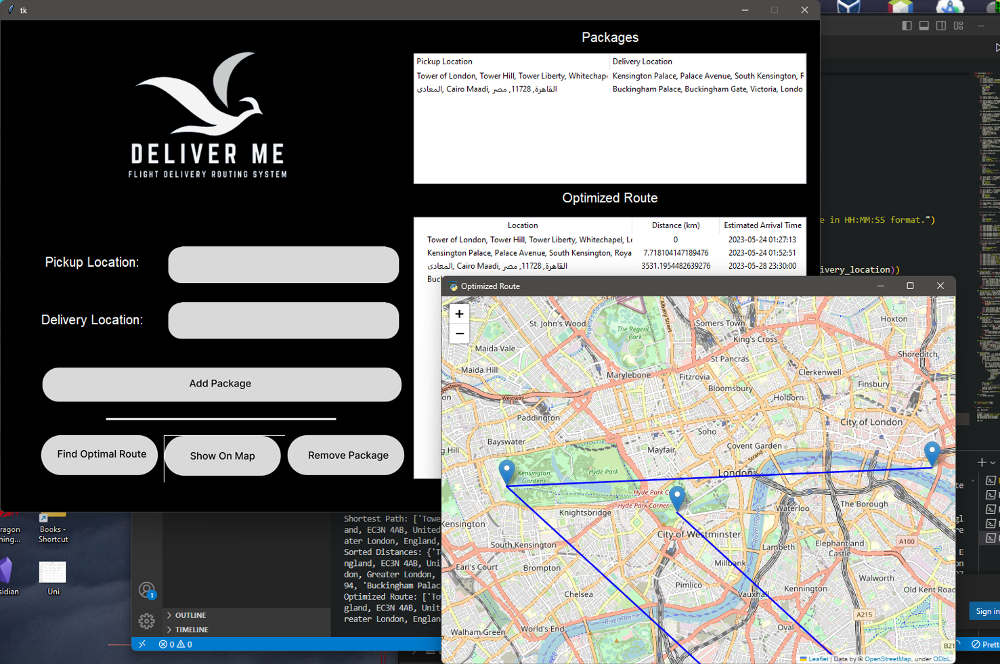

## Projects For CS Courses
This repo contains small size projects made for CS courses

### ChatT(Socket Chat Room Application)
This project uses sockets to send text, images, file messages between multiple clients handled by the server, it also uses RMI(Remote Method Invocation) to access and save the messages into the database, The CLIENT has the ability to download and upload files and images with eachother, both the Client and Server are written in pure Java

### DeliverMe(Drone Courier Routing System)
This Application given a list of pickup and delivery location for packages, uses graph algorithm to find the shortest route to deliver and pickup all the packages in the most optmial fashion, the algorithm it's based on is dijkstra's algorithm, The application has a GUI interface allowing the user to add the pickup and delivery Adress Using natural language, calculate the optimal path, and the show this path marked by markers in An interactive map provided by OpenStreetMap

